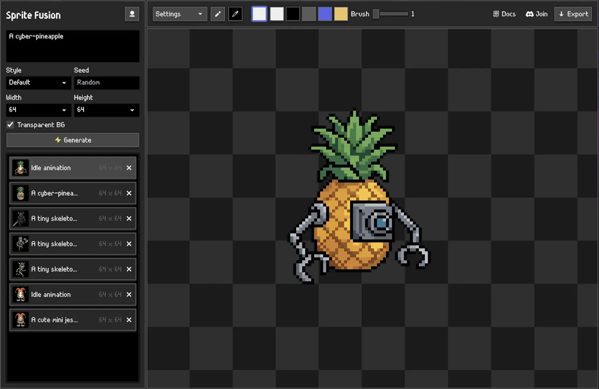

# Sprite Fusion for Godot

[Sprite Fusion](https://www.spritefusion.com/pixel-art-generator) is a professional pixel-art sprites and animations generator. This is the native plugin for the Godot editor.

## Installation

### Godot Asset Library (recommended)

1. Open the `AssetLib` tab in Godot and search for `Sprite Fusion`, or open the [Sprite Fusion Asset Store page](https://store.godotengine.org/asset/hugo/sprite-fusion/).
2. Download and install the plugin in your project.
3. Open `Project > Project Settings > Plugins` and enable `Sprite Fusion`.
4. Open the Sprite Fusion dock and connect your account.

### Manual installation from GitHub

1. Open the [latest GitHub release](https://github.com/Hugo-Dz/spritefusion-godot/releases/latest).
2. Under **Assets**, download **Source code (zip)** and extract it.
3. Copy the extracted `addons/spritefusion` folder into your project's `addons` folder.
4. Open `Project > Project Settings > Plugins` and enable `Sprite Fusion`.
5. Open the Sprite Fusion dock and connect your account.

## Requirements

- Godot 4.x
- Sprite Fusion account

## Usage

1. Click `Connect` in the Sprite Fusion dock.
2. Approve the device code in your browser.
3. Enter a prompt, choose `16x16`, `32x32`, or `64x64`, and click `Generate`.
4. Sprite Fusion saves up to 12 generated images to your project.
5. Select a generated image, enter an animation prompt, and click `Animate`.

Generated assets are written to `res://spritefusion/generated`.

## Useful links

- [Sprite Fusion website](https://www.spritefusion.com)
- [Godot plugin documentation](https://www.spritefusion.com/docs/pixel-art-generator/integrations/godot)
- [Latest GitHub release](https://github.com/Hugo-Dz/spritefusion-godot/releases/latest)

## License

This plugin is licensed under MIT.
